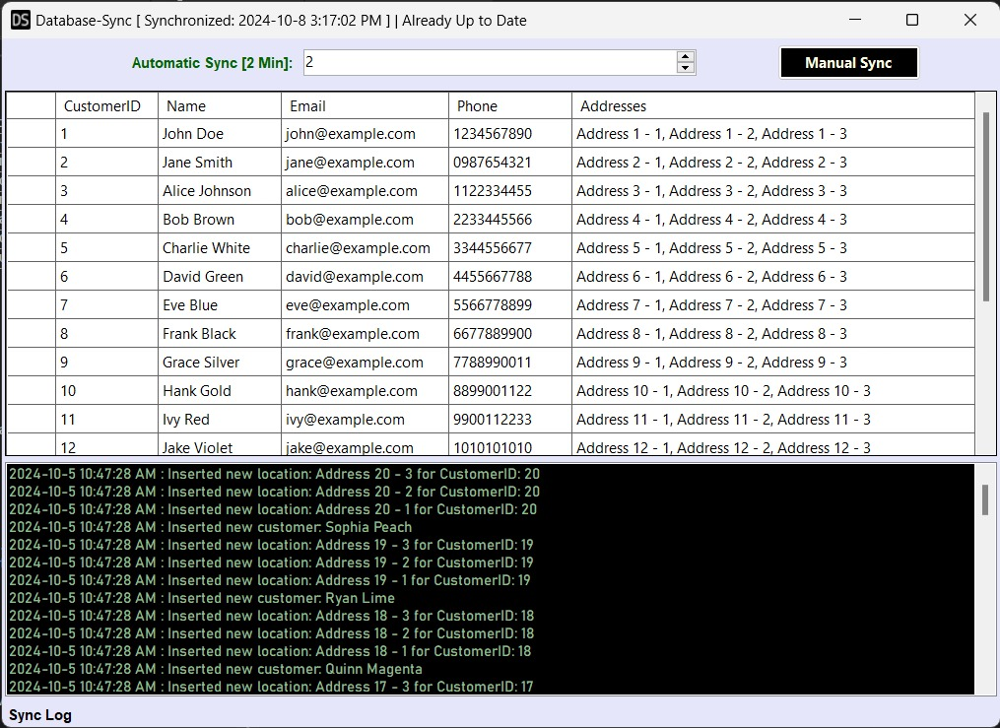

# db-sync

## Table of Contents

- [**Project Overview**](#project-overview)
- [**Technologies Used**](#technologies-used)
- [**Project Architecture**](#project-architecture)
- [**Project Structure**](#project-structure)
- [**Database Design**](#database-design)
  - [Source Database (MSSQL)](#source-database-mssql)
  - [Target Database (SQLite)](#target-database-sqlite)
- [**Setup Instructions**](#setup-instructions)
  - [Prerequisites](#prerequisites)
  - [Database Setup](#database-setup)
- [**Screenshot**](#screenshot)

---

## Project Overview

This project is a **.NET desktop application** developed using C# that synchronizes data from a source **MSSQL** database to a target **SQLite** database at user-defined intervals. The application provides both automated and manual synchronization options, logs each synchronization operation, and tracks changes made to the data during synchronization.

---

## Technologies Used

- **Windows Forms**: A UI framework in .NET used for building desktop applications. It provides controls, forms, and other elements to create graphical user interfaces.
- **Entity Framework Core**: An ``Object-Relational Mapper (ORM)`` that simplifies database interactions by allowing developers to work with databases using .NET objects, without writing SQL directly.
- **MSSQL Server**: The source database system, which is a powerful and scalable relational database management system from ``Microsoft``, used to store and manage application data.
- **SQLite**: A lightweight, file-based database system used locally, often for offline or embedded use cases. The data in this database is managed using tools like **DB Browser for SQLite**, which provides a GUI for browsing and managing SQLite databases.
---

## Project Architecture


The application uses a **Layered Architecture** with three layers:

1. **View Layer**: Built with **Windows Forms**, it handles the user interface and user interactions.
2. **Business Layer**: Manages synchronization logic and logging of sync activities, separating business rules from other concerns.
3. **Persistence Layer**: Uses **Entity Framework Core** to handle data access for both **MSSQL** and **SQLite** databases, ensuring clean separation between business logic and database operations.

This structure enhances **modularity**, **maintainability**, and **separation of concerns**.

---

## Project Structure

```
├───Business                    # Business logic layer
│   ├───Result                  # Handles business operation results
│   └───Service                 # Services implementing business logic
│       ├───Implementation      # Concrete service implementations
│       └───Interface           # Service interfaces
├───Persistence                 # Data access layer
│   ├───Context                 # DbContext for database interaction
│   ├───Entities                # Entity models representing database tables
│   ├───Repository              # Repository pattern for data access
│   │   ├───Implementation      # Concrete repository implementations
│   │   │   ├───Local           # Repositories for local (SQLite) database
│   │   │   └───Server          # Repositories for server (MSSQL) database
│   │   └───Interface           # Repository interfaces
│   │       ├───Local           # Interfaces for local database repositories
│   │       └───Server          # Interfaces for server database repositories
│   ├───Seeder                  # Data seeder for populating initial database data
│   └───UnitOfWork              # Unit of Work pattern for coordinating repository actions
│       ├───Implementation      # Concrete Unit of Work implementations
│       └───Interface           # Unit of Work interfaces
└───View                        # Presentation layer
    ├───ViewModel               # ViewModel for data binding between views and business logic
    └───Window                  # Windows Forms and UI components
```

---

## Database Design

### Source Database (MSSQL)

*Tables:*

- *Customers*
  - ``CustomerID`` (INT, Primary Key)
  - ``Name`` (VARCHAR(100))
  - ``Email`` (VARCHAR(100))
  - ``Phone`` (VARCHAR(15))

- *Locations*
  - ``LocationID`` (INT, Primary Key)
  - ``CustomerID`` (INT, Foreign Key referencing Customer.CustomerID)
  - ``Address`` (VARCHAR(200))

### Target Database (SQLite)

*Tables:*

- *Customers*
  - ``CustomerID`` (INT, Primary Key)
  - ``Name`` (VARCHAR(100))
  - ``Email`` (VARCHAR(100))
  - ``Phone`` (VARCHAR(15))

- *Locations*
  - ``LocationID`` (INT, Primary Key)
  - ``CustomerID`` (INT, Foreign Key referencing Customer.CustomerID)
  - ``Address`` (VARCHAR(200))

- *SyncLogs*
  - ``SyncLogID`` (INT, Primary Key, Auto-Increment)
  - ``Timestamp`` (DATETIME)
  - ``Message`` (TEXT)

---

## Setup Instructions

### Prerequisites

Before you begin, ensure you have the following installed:

- [**.NET Core 8 SDK**](https://dotnet.microsoft.com/download/dotnet/8.0)
- [**Visual Studio 2022 or later**](https://visualstudio.microsoft.com/downloads/) with the Desktop Development with C#.
- [**SQL Server**](https://www.microsoft.com/en-us/sql-server/sql-server-downloads) (for managing the remote database)


### Database Setup

Run the commands in the **Nuget Package Manager Console** on **Visual Studio**:

1. **Local Database (SQLite)**
   - The local database will be created automatically in the user's Local Application Data folder. However, you can manage it using [DB Browser for SQLite](https://sqlitebrowser.org/) for any manual operations.
     ```bash
     Add-Migration Init -Context LocalDbContext
     Update-Database update -Context LocalDbContext
     ```

2. **Server Database (MSSQL)**
   - Ensure that SQL Server is running on your machine.
     ```bash
     Add-Migration Init -Context ServerDbContext
     Update-Database update -Context ServerDbContext
     ```
---

## Screenshot

